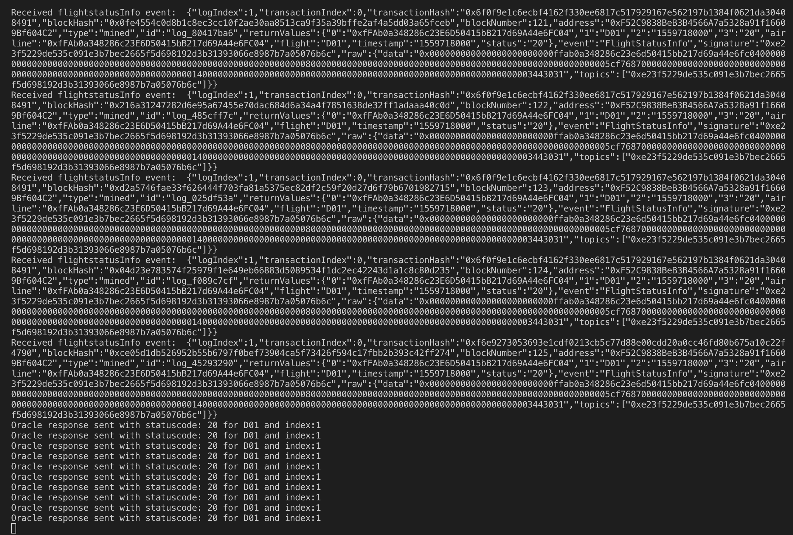

# FlightSurety

FlightSurety is a blockchain application project with the following features.

* A data layer that maintains all the airlines, flights, and passengers information
* An app layer which takes care of sending the data to the data layer for persistence, interfaces with the passengers to add insurance or credit them with the insurance amount, fetches flight status from the oracles
* A list of 50 oracles that generate random flight status
* An oracles server to generate random flight status
* The client side which sends request to register an airline, add insurance for passengers and credit insurance amount to the passengers.

# Flight Surety UI

# Oracle

## Install

This repository contains Smart Contract code in Solidity (using Truffle), tests (also using Truffle), dApp scaffolding (using HTML, CSS and JS) and server app scaffolding.

To install, download or clone the repo, then:

* Install dependencies
`npm install`
* Start Ganache, make sure ganache-cli is installed locally
`npm run ganache`
* Compile and migrate the contracts to development network
`npm run compile && npm run migrate`

## Develop Client

To run truffle tests:

`npm run test`
`npm run testOracle`

To use the dapp:

`npm run dapp`

To view dapp:

`http://localhost:8000`

## Develop Server

`npm run server`

## Deploy

To build dapp for prod:
`npm run dapp:prod`

Deploy the contents of the ./dapp folder

## Resources

* [How does Ethereum work anyway?](https://medium.com/@preethikasireddy/how-does-ethereum-work-anyway-22d1df506369)
* [BIP39 Mnemonic Generator](https://iancoleman.io/bip39/)
* [Truffle Framework](http://truffleframework.com/)
* [Ganache Local Blockchain](http://truffleframework.com/ganache/)
* [Remix Solidity IDE](https://remix.ethereum.org/)
* [Solidity Language Reference](http://solidity.readthedocs.io/en/v0.4.24/)
* [Ethereum Blockchain Explorer](https://etherscan.io/)
* [Web3Js Reference](https://github.com/ethereum/wiki/wiki/JavaScript-API)